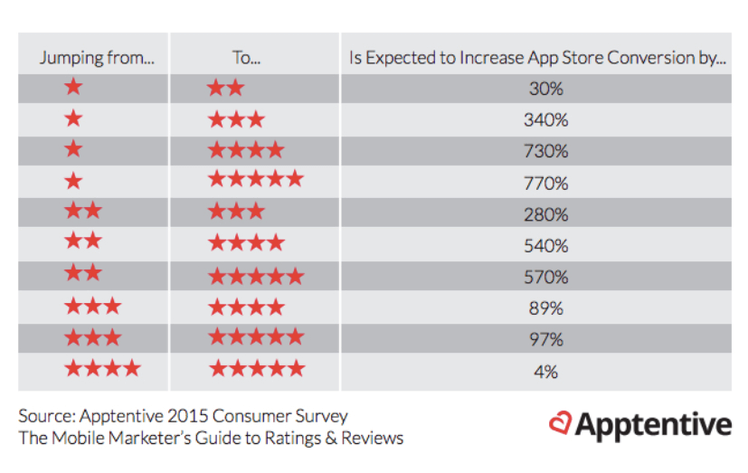

```{r setup, include=FALSE}
knitr::opts_chunk$set(echo = FALSE)
```

## 1.0 Introduction

The ever-changing mobile landscape is a challenging space to navigate. . The percentage of mobile over desktop is only increasing. Android holds about 53.2% of the smartphone market, while iOS is 43%. To get more people to download your app, you need to make sure they can easily find your app. Mobile app analytics is a great way to understand the existing strategy to drive growth and retention of future user.

With million of apps around nowadays, the following data set has become very key to getting top trending apps in iOS app store. This data set contains more than 7000 Apple iOS mobile application details. The data was extracted from the iTunes Search API at the Apple Inc website.

### 1.1 Scope of work & Business task

This study aim to offer general insights obtained from an exploratory data analysis of the App Store data.

## 2.0 Data

The data was extracted from the iTunes Search API at the Apple Inc website and store it on [**Kaggle**](https://www.kaggle.com). This data set is provided in csv format and has a Kaggle was already cleaned and features were drescribed for easy understanding. The data set was updated for the last time on June 2018 with data collected on July 2017 and it contains general information, description and user rate of each App.

## 3.0 Tools and process

The analysis was performed using R coding language. A complete list of R packages and the source code are all avaible on the project github repository.


```{r Tools and process, warning = FALSE, error = FALSE, message = FALSE, echo = FALSE}
#Data exploration----

library(tidyverse)
library(visdat)
library(correlationfunnel)
library(skimr)
library(cowplot)

```

```{r Load Data, warning=FALSE, error=FALSE, message=FALSE, echo=FALSE}
#1.0 Load Data----
path_main<- "Data/AppleStore.csv"
path_desc<- "Data/appleStore_description.csv"


main_raw_tbl<- read.csv(path_main)
desc_raw_tbl<- read.csv(path_desc)

unified_raw_tbl<- merge(main_raw_tbl, desc_raw_tbl[,-c(2,3)], by = "id", all.x = T)

```
\pagebreak

## 4.0 Analysis

The Dataset contain information about `r nrow(unified_raw_tbl)` Apps with `r ncol(unified_raw_tbl)` variables.
`r length(unique(unified_raw_tbl$prime_genre))` different categories of Apps were identified.

```{r EDA - Sanity Check, warning=FALSE, error=FALSE, message=FALSE, echo=FALSE, out.width='50%'}
#Sanity check
unified_raw_tbl<- unified_raw_tbl[,-2] #drop meaningless "X" column 

vis_miss(unified_raw_tbl)

#Refactoring
unified_raw_tbl$cont_rating<- as_factor(unified_raw_tbl$cont_rating)

unified_raw_tbl$prime_genre<- as_factor(unified_raw_tbl$prime_genre)


vis_dat(unified_raw_tbl)

```
A preliminary sanity check was performed, it shows no NAs and small data type modifications were made.

```{r EDA - Category 1, warning=FALSE, error=FALSE, message=FALSE, echo=FALSE, out.width='50%'}
##Category analysis ----

#Category presence in the store
unified_raw_tbl %>% group_by(prime_genre) %>%
                    summarise(n = n()) %>%
                    ggplot(aes(n, reorder(prime_genre, -n), fill = prime_genre)) +
                    geom_bar(stat = "identity") +
                    scale_y_discrete(limits = rev)+
                    theme_minimal() +
                    tidyquant::scale_fill_tq() +
                    theme(legend.position = "NONE") +
                    labs(title = "App category presence in the store", 
                         subtitle = "Games and Entertaiment dominate the App Store",
                         x = "Number of App",
                         y = "Category")

#Category presence by PAID or FREE
unified_raw_tbl %>% mutate(is_free = case_when(price == 0 ~ "FREE", TRUE ~ "PAID")) %>%
                    ggplot(aes(x = reorder(prime_genre, prime_genre, function(x)length(x)), fill = prime_genre)) +
                    geom_bar(stat = "count") +
                    facet_wrap(~is_free) +
                    coord_flip() +
                    theme_minimal() +
                    tidyquant::scale_fill_tq() +
                    theme(legend.position = "NONE") +
                    labs(title = "App category presence in the store grouped by Free or Paid", 
                         subtitle = "Generally free app are more present in the app store with some exceptions",
                         x = "Number of App",
                         y = "Category")

#Average price by category
unified_raw_tbl %>% filter(price > 0) %>%
                    group_by(prime_genre) %>%
                    summarise(avg_price = mean(price)) %>%
                    ggplot(aes(avg_price, reorder(prime_genre, avg_price), fill = prime_genre)) +
                    geom_bar(stat = "identity") +
                    scale_x_continuous(labels = scales::dollar_format(), breaks = seq(0, 21, 3)) +
                    theme_minimal() +
                    tidyquant::scale_fill_tq() +
                    theme(legend.position = "NONE") +
                    labs(title = "Average price for paid app by catagory", 
                         subtitle = "Apps related to health-care professions are the most expensive",
                         x = "Average Price in USD",
                         y = "Category")

```

Games are the most frequent App category in the store followed by Entertainment and Education. Free Apps are noticeably more present but almost same category proportions are maintained also when we split the App store in paid App and free App.

Excluding free Apps, Medical related Apps are, on average, more expensive with an average price of `r round(mean(unified_raw_tbl$price[which(unified_raw_tbl$price > 0 & unified_raw_tbl$prime_genre == "Medical")]),1)`. Work and study related Apps has also a noticeably bigger price compared to entertaining and free time Apps.


```{r EDA - Category 2, warning=FALSE, error=FALSE, message=FALSE, echo=FALSE, out.width='50%'}
#Description by category
unified_raw_tbl %>% group_by(prime_genre) %>%
                    summarise(avg_scsh_dspl = mean(ipadSc_urls.num)) %>%
                    ggplot(aes(avg_scsh_dspl, reorder(prime_genre, avg_scsh_dspl), fill = prime_genre)) +
                    geom_bar(stat = "identity") +
                    tidyquant::scale_fill_tq() +
                    theme_minimal() +
                    theme(legend.position = "NONE") +
                    labs(title = "Average App screenshots displayed in the description by category",
                         x = "Average pictures displayed",
                         y = "Category")

unified_raw_tbl %>% group_by(prime_genre) %>%
                    summarise(avg_desc_len = mean(nchar(app_desc))) %>%
                    ggplot(aes(avg_desc_len, reorder(prime_genre, avg_desc_len), fill = prime_genre)) +
                    geom_bar(stat = "identity") +
                    tidyquant::scale_fill_tq() +
                    theme_minimal() +
                    theme(legend.position = "NONE") +
                    labs(title = "Average description length by App category",
                         x = "Average description length",
                         y = "Category")
```
An analysis on how the different categories communicate to the customers was made. Some categories are more prone to communicate with images rather than text. For example, Games on average is the second most App category for the usage of images but if we look at the other plot we can see that Games is the second last for text length.


```{r EDA - Price 1, warning=FALSE, error=FALSE, message=FALSE, echo=FALSE, out.width='50%'}
##Price Analysis ----
unified_raw_tbl %>% mutate(is_free = case_when(price == 0 ~ "FREE", TRUE ~ "PAID")) %>%
                    group_by(is_free) %>%
                    summarise(n = n()) %>%
                    mutate(pct = n / sum(n)) %>%
                    ggplot(aes(is_free, pct, fill = is_free)) +
                    geom_bar(stat = "identity") +
                    scale_y_continuous(labels = scales::percent_format()) +
                    tidyquant::scale_fill_tq() +
                    theme_minimal() +
                    theme(legend.position = "NONE") +
                    labs(title = "FREE Vs PAID App presence in the store",
                        subtitle = "Noticeably more free app are present in the store",
                        y = "App presence in %",
                        x = "")

a <- unified_raw_tbl %>% filter(price > 0) %>%
                         ggplot(aes(price)) +
                         geom_density(adjust = 40, fill = tidyquant::palette_light()[[1]]) + 
                         theme_minimal() +
                         scale_x_continuous(labels = scales::dollar_format()) +
                         xlab("Price in USD") +
                         ylab("Number of App")

b<- unified_raw_tbl %>% filter(price > 0) %>%
                        ggplot(aes(price)) +
                        geom_boxplot(outlier.colour = tidyquant::palette_light()[[2]]) +
                        theme_minimal() +
                        scale_x_log10(labels = scales::dollar_format()) +
                        coord_flip() +
                        xlab("Price in USD")

plot_raw<- plot_grid(a, b, nrow = 1)

title <- ggdraw() + 
         draw_label("Price distribution inside App Store",
         x = 0,
         hjust = 0) + 
         theme_minimal() +
         theme(plot.margin = margin(0, 0, 0, 7))

plot_grid(title, plot_raw, ncol = 1, rel_heights = c(0.1, 1))


```

As previously mentioned there are more free App than paid ones. Free app were filtered out and a price distribution analysis was performed showing that prices, regardless the category, has a bottom margin of `r min(unified_raw_tbl$price[which(unified_raw_tbl$price > 0)])` and an upper margin of `r max(unified_raw_tbl$price[which(unified_raw_tbl$price > 0)])` with an average  of `r mean(unified_raw_tbl$price[which(unified_raw_tbl$price >0)])` and standard deviation of `r sd(unified_raw_tbl$price[which(unified_raw_tbl$price >0)])`. Is noticeable that prices are very skewed on the left and some really big outliers are present.

```{r EDA - Price 2, warning=FALSE, error=FALSE, message=FALSE, echo=FALSE, out.width='50%'}

'%!in%' <- function(x,y)!('%in%'(x,y))
not_free<- which(unified_raw_tbl$price > 0)
price_outliers<- boxplot(unified_raw_tbl$price[not_free], plot = FALSE)$out

unified_raw_tbl %>% filter(price >0 & price %!in% price_outliers) %>%
                    ggplot(aes(price)) +
                    geom_histogram(aes(y = ..density..), color = "black", fill = "white") +
                    geom_density(fill = tidyquant::palette_light()[[1]], alpha = .4) +
                    geom_vline(aes(xintercept=mean(price)), color = "black", linetype="dashed", size=1) +
                    theme_minimal() +
                    scale_x_continuous(labels = scales::dollar_format()) +
                    labs(title = "Price distribution without outliers", 
                         x = "Price in USD")

unified_raw_tbl %>% filter(price > 0 & price %!in% price_outliers) %>%
                    ggplot(aes(price, fill = prime_genre)) +
                    geom_density(alpha = .4) +
                    scale_x_continuous(labels = scales::dollar_format()) +
                    theme_minimal() +
                    tidyquant::scale_fill_tq() +
                    theme(legend.position = "NONE") +
                    facet_wrap(~prime_genre, nrow = 6) +
                    labs(title = "Price distribution by category", 
                         subtitle = "Outliers excluded",
                         x = "Price in USD")
```

If outliers are removed the plot shows clearly how the prices inside the App store are divide in tiers.
If a division in category is applied keeping filtered out free Apps and outliers some trends in pricing the Apps. (Catalogs and Shopping once filtered for outliers and free Apps has too few data points)

```{r EDA - Price 3, warning=FALSE, error=FALSE, message=FALSE, echo=FALSE, out.width='50%'}
unified_raw_tbl %>% filter(price > 0) %>%
                    group_by(sup_devices.num) %>%
                    summarise(avg_price = mean(price)) %>%
                    ggplot(aes(sup_devices.num, avg_price)) +
                    geom_point(color = tidyquant::palette_light()[[2]], size = 3) +
                    geom_line(size = 1, color = tidyquant::palette_light()[[1]]) +
                    geom_smooth(method = "loess") +
                    scale_y_continuous(labels = scales::dollar_format()) +
                    theme_minimal() +
                    labs(title = "Supported device vs Price",
                         x = "Number of supported devices",
                         y = "Average price in USD")

unified_raw_tbl %>% filter(price > 0) %>%
                    group_by(lang.num) %>%
                    summarise(avg_price = mean(price)) %>%
                    ggplot(aes(lang.num, avg_price)) +
                    geom_point(color = tidyquant::palette_light()[[2]], size = 3) +
                    geom_line(size = 1, color = tidyquant::palette_light()[[1]]) +
                    geom_smooth(method = "loess") +
                    scale_y_continuous(labels = scales::dollar_format()) +
                    theme_minimal() +
                    labs(title = "Language vs Price",
                         subtitle = "No clear influence of supported languages on price",
                         x = "Number of supported languages",
                         y = "Average Price")

unified_raw_tbl %>% filter(price >0) %>%
                    mutate(size_MB = size_bytes / 1000000) %>%
                    ggplot(aes(size_MB, price)) +
                    geom_line(size = 1, color = tidyquant::palette_light()[[1]]) +
                    scale_y_continuous(labels = scales::dollar_format()) +
                    theme_minimal() +
                    labs(title = "Price Vs App size in Mb", 
                         subtitle = "No clear influence of App size on price",
                         x = "App size in Mb",
                         y = "Price in USD")

unified_raw_tbl %>% filter(price > 0) %>%
                    group_by(cont_rating) %>%
                    summarise(avg_price = mean(price)) %>%
                    ggplot(aes(reorder(cont_rating, avg_price), avg_price, fill = cont_rating)) +
                    geom_bar(stat = "identity") +
                    scale_y_continuous(labels = scales::dollar_format()) +
                    tidyquant::scale_fill_tq() +
                    theme_minimal() +
                    theme(legend.position = "NONE") +
                    labs(title = "Price Vs App content age rating",
                         x = "Content age rating",
                         y = "Price in USD")
```

Some deeper investigation to possible relation that can influence the price of an App was performed. As the number of supported devices grows there is a possible trend in lowering the price which is counter intuitive if we suppose that more supported device equal more development cost. Instead, the number of supported languages and the size of the App in Mb didn't reveal a clear influence on the App price. The Price Vs content age rating reveal that App for adult are slightly cheaper on average.

```{r EDA - Market 1, warning=FALSE, error=FALSE, message=FALSE, echo=FALSE, out.width='50%'}
##Market Analysis---- 
unified_raw_tbl %>% filter(price > 0) %>%
                    mutate(bottom_rev = price * rating_count_tot) %>%
                    group_by(prime_genre) %>%
                    summarise(avg_bottom_rev = mean(bottom_rev)) %>%
                    ggplot(aes(avg_bottom_rev, reorder(prime_genre, avg_bottom_rev), fill = prime_genre)) +
                    geom_bar(stat = "identity") +
                    theme_minimal() +
                    tidyquant::scale_fill_tq() +
                    scale_x_continuous(labels = scales::dollar_format()) +
                    theme(legend.position = "NONE") +
                    labs(title = "Estimated average bottom revenue by category",
                         subtitle = "Excluding free app",
                         x = "Average bottom revenue in USD",
                         y = "Category")


unified_raw_tbl %>% mutate(bottom_rev = price * rating_count_tot) %>%
                    slice_max(order_by = bottom_rev, n = 10) %>% 
                    select(track_name, prime_genre, bottom_rev) %>%
                    mutate(track_name = strtrim(track_name, width = 23)) %>%
                    ggplot(aes(bottom_rev, reorder(track_name, bottom_rev), fill = prime_genre)) +
                    geom_bar(stat = "identity") +
                    theme_minimal() +
                    tidyquant::scale_fill_tq() +
                    scale_x_continuous(labels = scales::dollar_format(scale = 1/1000000, prefix = "$", suffix = "M")) +
                    labs(title = "Top 10 app for estimated bottom revenue",
                         subtitle = "Games are the top performers for revenue",
                         x = "Estimated bottom revenue",
                         y = "App name")

```
An estimation of the profits generated by the Apps was performed. The estimation was calculated multiplying the price by the total number of user rates, this can give as a bottom estimation of their revenues. 
According to the above, business Apps are the most profitable on average because even if their presence in the App Store is very small, they are really requested and their average price, as showed before, is really high. If we look at the top 10 performer in revenue is noticeable that the are almost all games. This shows why mobile gaming is a really hot topic right now.

```{r EDA - Market 2, warning=FALSE, error=FALSE, message=FALSE, echo=FALSE}

unified_raw_tbl %>% group_by(prime_genre) %>%
                    mutate(bottom_rev = price * rating_count_tot) %>%
                    summarise(mrkt_val = sum(bottom_rev)) %>%
                    mutate(pct = mrkt_val/sum(mrkt_val)) %>%
                    mutate(prime_genre_2 = "A") %>%
                    mutate(prime_genre_2 = case_when(pct < 0.01 ~ "Other (summed)", TRUE ~ as.character(prime_genre)))%>%
                    group_by(prime_genre_2) %>%
                    summarise(pct = sum(pct), mrkt_val = sum(mrkt_val)) %>%
                    ggplot(aes(mrkt_val, reorder(prime_genre_2, mrkt_val), fill = prime_genre_2,
                               label = scales::percent(round(pct, 2)))) +
                    geom_bar(stat = "identity") +
                    geom_text(stat = "identity", hjust = -0.5, size = 3) +
                    scale_x_continuous(labels = scales::dollar_format(scale = 1/1000000, prefix = "$", suffix = "M")) +
                    expand_limits(x = c(0, 30000000)) +
                    theme_minimal() +
                    tidyquant::scale_fill_tq() +
                    theme(legend.position = "NONE") +
                    labs(title = "Estimated market bottom value by App category",
                         subtitle = "Gaming App represents the biggest market share",
                         x = "Estimated market value in USD",
                         y = "Category")

```
Even if Business Apps are the best in term of average revenues if all the revenues generated in the store are taken and split by category, Games is the one with the biggest share of generated revenues. 

```{r EDA - User rating 1, warning=FALSE, error=FALSE, message=FALSE, echo=FALSE, out.width='50%'}

unified_raw_tbl %>% ggplot(aes(user_rating)) +
                    geom_density(fill = tidyquant::palette_light()[[1]]) +
                    theme_minimal() +
                    geom_vline(aes(xintercept=mean(user_rating)), color = tidyquant::palette_light()[[2]], 
                               linetype="dashed", size=1) +
                    labs(title = "User rating distribution",
                         subtitle = "User rating are largerly skewed on the right",
                         x = "User rating")

unified_raw_tbl %>% ggplot(aes(user_rating, fill = prime_genre)) +
                    geom_bar(stat = "count") +
                    theme_minimal() +
                    tidyquant::scale_fill_tq() +
                    facet_wrap(~prime_genre, scales = "free_y") +
                    theme(legend.position = "NONE") +
                    labs(title = "User rating distribution across App category",
                         subtitle = "More extreme values are (0 or 4+) are preferred",
                         x = "User rating")

unified_raw_tbl %>% filter(price > 0) %>%
                    mutate(user_rating = round(user_rating)) %>%
                    group_by(user_rating) %>%
                    summarise(avg_price = mean(price)) %>%
                    ggplot(aes(as.factor(user_rating), avg_price, fill = as.factor(user_rating))) +
                    geom_bar(stat = "identity") +
                    theme_minimal() +
                    tidyquant::scale_fill_tq() +
                    scale_y_continuous(labels = scales::dollar_format()) +
                    theme(legend.position = "NONE") +
                    labs(title = "Average Price vs User Rating",
                         subtitle = "Excluding free app",
                         x = "User Rating",
                         y = "Average Price in USD")

cutpoints<- quantile(unified_raw_tbl$price[which(unified_raw_tbl$price >0)])

unified_raw_tbl %>% filter(price >0) %>%
                    mutate(price_range = case_when(price <= cutpoints[1] ~ "Under 1$",
                                                   price > cutpoints[1] & price <= cutpoints[2] ~ "1-2$",
                                                   price > cutpoints[2] & price <= cutpoints[3] ~ "2-3$",
                                                   price > cutpoints[3] & price <= cutpoints[4] ~ "3-5$",
                                                   price > cutpoints[4] ~ "Over 5$")) %>%
                   mutate(price_range = as.factor(price_range)) %>%
                   ggplot(aes(as.factor(round(user_rating)), fill = as.factor(round(user_rating)))) +
                   geom_bar(stat = "count") +
                   facet_wrap(~ price_range, scales = "free") +
                   theme_minimal() +
                   tidyquant::scale_fill_tq() +
                   theme(legend.position = "NONE") +
                   labs(title = "User rating frequency by price range",
                        x = "User Rating",
                        y = "Number of rates")

```

As well explained in this article by [**Harvard Business Review**](https://hbr.org/2019/07/the-problems-with-5-star-rating-systems-and-how-to-fix-them) 5 stars review system has a big flaw. Users who have extreme experiences (either very bad or very good) are much more likely to leave feedback than users who have average experiences, thus creating selection biases, as showed in the first plot rates are concentrated on the extreme positive (4 or bigger) and negative (0). It is possible to notice the same effect across all the App category.

Price doesn't seem to affect the rating of the app generally even if we segment the price in 5 different ranges.

```{r EDA - User rating 2, warning=FALSE, error=FALSE, message=FALSE, echo=FALSE, out.width='50%'}



unified_raw_tbl %>% select(user_rating, user_rating_ver, prime_genre) %>%
                    mutate(ev_user_rating_prev_ver = (user_rating * 2) - user_rating_ver) %>%
                    mutate(ev_user_rating_prev_ver = case_when(ev_user_rating_prev_ver < 0 ~ 0,
                                                               TRUE ~ ev_user_rating_prev_ver)) %>%
                    mutate(rating_delta= case_when((user_rating_ver - ev_user_rating_prev_ver) < -5 | (user_rating_ver - ev_user_rating_prev_ver) > 5 ~ (user_rating_ver - user_rating),
                                                    TRUE ~ user_rating_ver - ev_user_rating_prev_ver)) %>%
                    filter(rating_delta > ev_user_rating_prev_ver) %>%
                    mutate(ev_conversion_increase = case_when(rating_delta >= 4 ~ "770%",
                                                              ev_user_rating_prev_ver  <=1.5 & round(rating_delta) == 2 ~ "30%",
                                                              ev_user_rating_prev_ver  <=1.5 & round(rating_delta) == 3  ~ "340%",
                                                              ev_user_rating_prev_ver  <=1.5 & round(rating_delta) == 4  ~ "730%",
                                                              round(ev_user_rating_prev_ver)  == 2 & round(rating_delta) == 3  ~ "280%",
                                                              round(ev_user_rating_prev_ver)  == 2 & round(rating_delta) == 4  ~ "540%",
                                                              round(ev_user_rating_prev_ver)  == 2 & round(rating_delta) == 5  ~ "570%",
                                                              round(ev_user_rating_prev_ver)  == 3 & round(rating_delta) == 4  ~ "89%",
                                                              round(ev_user_rating_prev_ver)  == 3 & round(rating_delta) == 5  ~ "97%",
                                                              round(ev_user_rating_prev_ver)  == 4 & round(rating_delta) == 5  ~ "4%")) %>%
                    #slice_max(order_by = rating_delta, n = 60)
                    filter(ev_conversion_increase == "770%") %>%
                    group_by(prime_genre) %>%
                    summarise(n = n()) %>%
                    ggplot(aes(n, reorder(prime_genre, n), fill = prime_genre)) +
                    geom_bar(stat = "identity") +
                    scale_x_continuous(breaks = c(2,5,8,10)) +
                    theme_minimal() +
                    tidyquant::scale_fill_tq() +
                    theme(legend.position = "NONE") +
                    labs(title = "41 apps by category that had an estimated exponential conversion growth compared to prev version",
                         subtitle = "Jumping from a rate of 1 to a rate of 5 between version create an expected conversion increase of 770%",
                         caption = "According to Apptetive 2015 survey, https://thetool.io/2017/improve-user-ratings",
                         x = "Number of Apps",
                         y = "Category")

```

Thanks to Apptetive 2015 survey it was possible to estimate the effect of the change, if it happened, in rating between the previous and current version. All Apps, that showed an amazing change from a rating of 1 (or less) to a rating of 5 increasing their App Store conversion rate by 770%, were selected and grouped by their category.

```{r EDA - User rating 3, warning=FALSE, error=FALSE, message=FALSE, echo=FALSE, out.width='50%'}

unified_raw_tbl %>% mutate(user_rating = round(user_rating_ver)) %>%
                    group_by(lang.num) %>%
                    summarise(avg_user_rating_ver = mean(user_rating_ver)) %>%
                    ggplot(aes(lang.num, avg_user_rating_ver)) +
                    geom_point(size = 2, color = tidyquant::palette_light()[[2]]) +
                    geom_line(size = 0.6, color = tidyquant::palette_light()[[1]]) +
                    geom_smooth(method = "loess") +
                    theme_minimal() +
                    labs(title = "Supported languages Vs User Rating",
                         x = "Supported languages",
                         y = "User Rating current version")
                    
unified_raw_tbl %>% mutate(user_rating_ver = round(user_rating_ver)) %>%
                    group_by(sup_devices.num) %>%
                    summarise(avg_user_rating_ver = mean(user_rating_ver)) %>%
                    ggplot(aes(sup_devices.num, avg_user_rating_ver)) +
                    geom_point(size = 2, color = tidyquant::palette_light()[[2]]) +
                    geom_line(size = 0.6, color = tidyquant::palette_light()[[1]]) +
                    geom_smooth(method = "loess") +
                    theme_minimal() +
                    labs(title = "Supported devices Vs User Rating",
                         x = "Supported devices",
                         y = "User Rating current version")


unified_raw_tbl %>% mutate(user_rating = round(user_rating)) %>%
                    group_by(ipadSc_urls.num) %>%
                    summarise(avg_user_rating = mean(user_rating)) %>%
                    ggplot(aes(ipadSc_urls.num, avg_user_rating)) +
                    geom_point(size = 2, color = tidyquant::palette_light()[[2]]) +
                    geom_line(size = 0.6, color = tidyquant::palette_light()[[1]]) +
                    geom_smooth(method = "glm") +
                    theme_minimal() +
                    labs(title = "Average user Rating Vs Number of screenshots showed for display",
                         x = "Number of screenshots showed for display",
                         y = "Average user rating")

unified_raw_tbl %>% mutate(user_rating = round(user_rating), desc_len = nchar(app_desc)) %>%
                    group_by(user_rating) %>%
                    summarise(avg_desc_len = mean(desc_len)) %>%
                    ggplot(aes(user_rating, avg_desc_len)) +
                    geom_point(size = 2, color = tidyquant::palette_light()[[2]]) +
                    geom_line(size = 0.6, color = tidyquant::palette_light()[[1]]) +
                    geom_smooth(method = "glm") +
                    theme_minimal() +
                    labs(title = "User rating Vs text description length",
                         x = "User rating",
                         y = "Average number of characters")


```

Now that the value of a good positive rating is estimated finding what can increase the user rating has a greater importance. An analysis of possible factors that can influence the user rating was performed discovering a possible positive influence of the number of languages and the number of pictures used in the App description. Also the length of the text description seems promising in increasing the user rate.

## 5.0 Conclusion

According to what found in the analysis the App Store is currently dominated by Games, both for presence and potential revenue, justifying the recent introduction of the arcade center by Apple. Going beyond Games App, other App category are really promising. For example Business app has a great average profit and demand with less competition compared to many other categories. Generally speaking the recommendation is to invest in the app description using both at least 4 images and over 1600 characters to increase the possibility of good reviews from users and consequently the conversion rate on the App Store. 